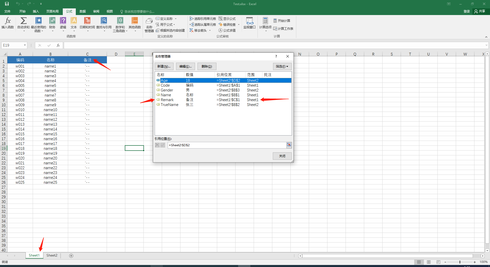

# ExcelToObject

#### 介绍
ExcelToObject，让操作excel像操作对象那么简单


#### 安装教程

​	

```shell
dotnet add package ExcelToObject.Npoi --version 1.0.0
```


#### 使用说明

1.  Web程序在Program或Startup中添加以下代码

```c#
service.AddExcelToObjectNpoiService();
```

2. 控制台程序

```
IExcelFactory _excelFactory=new NpoiExcelFactory();
```

3. 读取excel中一个Sheet页为列表

```c#
using (var excelAppService = _excelFactory.Create(System.IO.File.Open("./files/Test.xlsx", FileMode.OpenOrCreate, FileAccess.ReadWrite)))
{
    var list = excelAppService.ReadListByNameManager<TestImportInput>("Sheet1");
    foreach (var item in list)
    {
        Console.WriteLine($"编码：【{item.Code}】，名称：【{item.Name}】，备注：【{item.Remark}】");
    }
}
```

4. 读取excel中一个Sheet页为单个对象

```c#
using (var excelAppService = _excelFactory.Create(System.IO.File.Open("./files/Test.xlsx", FileMode.OpenOrCreate, FileAccess.ReadWrite)))
{
    var user = excelAppService.ReadByNameManager<TestUserOutput>("Sheet2");
    Console.WriteLine($"姓名：{user.TrueName}，年龄：{user.Age}，性别：{user.Gender}");
}
```

5. 写入一个list对象到excel的Sheet页

```c#
using (var excelAppService = _excelFactory.Create(System.IO.File.Open("./files/Test.xlsx", FileMode.OpenOrCreate, FileAccess.ReadWrite)))
{
    excelAppService.WriteListByNameManager(new List<TestImportInput> { new TestImportInput { Code = "", Name = "", Remark = "" } }, "Sheet2");
    excelAppService.Write("./files/Test_copy1.xlsx");
}
```

5. 写入一个对象到excel的sheet页

```c#
using (var excelAppService = _excelFactory.Create(System.IO.File.Open("./files/Test.xlsx", FileMode.OpenOrCreate, FileAccess.ReadWrite)))
{
    excelAppService.WriteByNameManager(new TestUserOutput { Age=18, Gender="男", TrueName="赵六" }, "Sheet2");
    excelAppService.Write("./files/Test_copy1.xlsx");
}
```


#### 原理



1. 通过excel的名称管理器，与实体的属性名称匹配起来
2. 通过传入的实体，获取实体属性。找出sheetName中的名称管理器，每个名称的坐标。进行读取。


#### 参与贡献

1.  Fork 本仓库
2.  新建 Feat_xxx 分支
3.  提交代码
4.  新建 Pull Request
